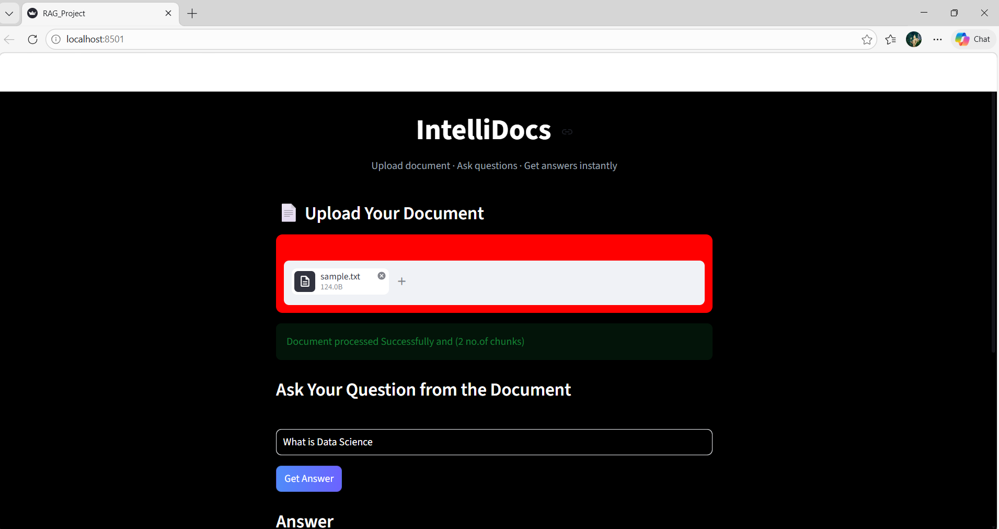
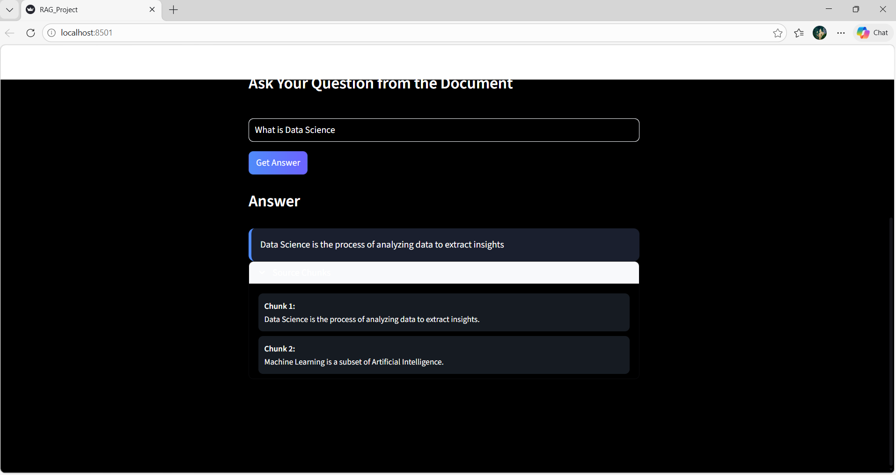
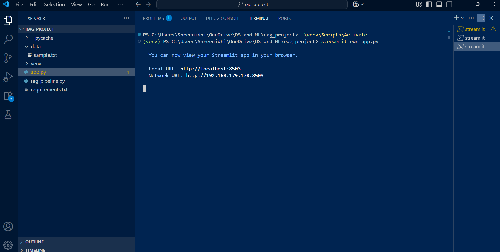

# IntelliDocs — RAG Document Question Answering

IntelliDocs is a Retrieval-Augmented Generation (RAG) based document question-answering application that allows users to upload a text document and ask questions based on its content.

The application uses Hugging Face sentence embeddings and FAISS vector similarity search to retrieve relevant information from the uploaded document and provide a concise answer.

## Features

* Upload `.txt` documents
* Split documents into smaller text chunks
* Generate semantic embeddings using Hugging Face
* Perform similarity-based document retrieval using FAISS
* Ask questions based on the uploaded document
* Extract the most relevant answer from retrieved content
* Display the source chunks used for answering
* Interactive Streamlit interface
* Reject irrelevant questions using a similarity threshold

## How It Works

The application follows these steps:

```text
Upload Document
       ↓
Read Document Content
       ↓
Split Text into Chunks
       ↓
Generate Embeddings
       ↓
Store Embeddings in FAISS
       ↓
User Enters Question
       ↓
Similarity Search
       ↓
Retrieve Top Relevant Chunks
       ↓
Extract Best Matching Sentence
       ↓
Display Answer + Source Chunks
```

## Tech Stack

| Technology            | Purpose                                    |
| --------------------- | ------------------------------------------ |
| Python                | Core programming language                  |
| Streamlit             | Web application interface                  |
| LangChain             | Text splitting and RAG pipeline components |
| Hugging Face          | Sentence embeddings                        |
| FAISS                 | Vector similarity search                   |
| Sentence Transformers | `all-MiniLM-L6-v2` embedding model         |

## Project Structure

```text
RAG-Document-QA/
│
├── app.py
├── rag_pipeline.py
├── requirements.txt
├── README.md
│
├── data/
│   └── sample.txt
│
├── app1.png
├── app2.png
├── terminal1.png
├── terminal2.png
│
└── About my project.docx
```

## Installation

### 1. Clone the repository

```bash
git clone https://github.com/srinidhi1310/RAG-Document-QA.git
```

### 2. Navigate to the project folder

```bash
cd RAG-Document-QA
```

### 3. Create a virtual environment

```bash
python -m venv venv
```

### 4. Activate the virtual environment

For Windows:

```bash
venv\Scripts\activate
```

### 5. Install dependencies

```bash
pip install -r requirements.txt
```

## Run the Application

Start the Streamlit application using:

```bash
streamlit run app.py
```

The application will open in your browser.

## Screenshots

### Application Interface



### Question Answering



### Terminal



## RAG Pipeline

The project uses the following retrieval pipeline:

### Document Processing

The uploaded text file is read and processed. `RecursiveCharacterTextSplitter` divides the document into manageable chunks.

### Embedding Generation

Each chunk is converted into a numerical vector using:

```text
sentence-transformers/all-MiniLM-L6-v2
```

### Vector Database

FAISS stores the generated embeddings and enables efficient similarity search.

### Retrieval

When a user asks a question, the system retrieves the top three most relevant chunks.

### Answer Extraction

The retrieved chunks are combined. The system compares query words with sentences from the retrieved context. The sentence with the highest matching score is selected as the answer.

## Key Learning Outcomes

Through this project, I explored:

* Retrieval-Augmented Generation concepts
* Text preprocessing and chunking
* Semantic embeddings
* Vector databases
* Similarity search
* LangChain components
* Hugging Face embedding models
* FAISS
* Streamlit application development
* Building an end-to-end AI application

## Future Improvements

Planned improvements include:

* Support for PDF and DOCX documents
* Integration of an LLM for generative answers
* Conversation history
* Multiple document support
* Improved answer ranking
* Better source citation
* Persistent vector database storage
* Advanced document retrieval techniques

## Author

**Shreenidhi Manickkavalli V**

B.Sc. Information Technology
PSG College of Arts & Science

GitHub: https://github.com/srinidhi1310

---

If you find this project interesting, feel free to explore the repository.
